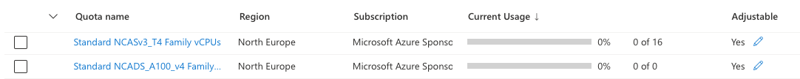

# Shakudo Deployment and Security Documentation - Azure - Jan 4, 2024 Update

# Deployment

## Azure permissions for Shakudo

Typically, the a **Contributor** role gives sufficient permissions to stand up the Shakudo platform from scratch, in a new subscription on Azure. For a more detailed list of permissions for a limited contributor role, please see the following page, or see [Azure docs](https://learn.microsoft.com/en-us/azure/aks/concepts-identity#aks-service-permissions) for reference.

[Permissions for Shakudo installation in Azure](Other/shakudo-install-perm.md)

## Required Azure Resources

### Kubernetes Environment Assumptions

The resource specification below makes the following assumptions about the existing setup:

- Azure cluster is not reachable from the outside (using an internal VNet)
- Dashboard login portal exposed via internal URL only accessible via VPN (this is optional, depending on your organization’s architecture)

### Load Balancer

The EKS cluster requires the ability to create a K8s `svc` with `type: LoadBalancer` that triggers the creation of an Azure Internal load balancer (within the VNet) and an External IP assignment for the K8s service, or has the permissions to use an existing private subnet.

### DNS for a URL to access your platform

Two settings will be required to successfully access the platform through the browser:

- A new `A` type record in the DNS settings for the domain (internal or external e.g., `shakudo.yourdomain.tld`) on which the platform will be exposed. Optionally, we can use the `[hyperplane.dev](http://hyperplane.dev)` domain owned by Shakudo, e.g.: `yourname.hyperplane.dev`
- A valid SSL certificate with its private key for the above domain. Alternatively, we can use Let’s Encrypt to generate the certificates. The Let’s Encrypt option would require an additional service account, with permissions to add records to the internal domain or subdomain DNS, to be available to the AKS cluster during deployment.

### Generic platform requirements

AKS cluster (this already exists)

### Namespaces

Shakudo platform requires the following namespaces where {prefix-} can be any prefix as required by the SRE team. These can either be created by our standard deployment scripts, or by your SRE team. 

Core platform:

- {prefix-}hyperplane-core
- {prefix-}hyperplane-postgres
- {prefix-}hyperplane-pgbouncer
- {prefix-}hyperplane-istio
- {prefix-}hyperplane-certmanager
- {prefix-}hyperplane-monitoring
- {prefix-}hyperplane-pipelines
- {prefix-}hyperplane-jhub
- {prefix-}hyperplane-conda

Stack Components:

- {prefix-}hyperplane-airbyte
- {prefix-}hyperplane-milvus
- {prefix-}hyperplane-llm

### Istio and the istio-system namespace

Shakudo uses Istio to manage access to services running within the environment. If an existing deployment of Istio is already installed, the platform can be configured to leverage it. Otherwise, a new namespace called `istio-system` needs to be created, and Istio can be deployed as part of the standard platform deployment process.

If Istio is not an option for access control and network traffic management, please let the Shakudo team know which ingress controller you use and we will define the appropriate configuration.

## Node Pools

************Please see az CLI commands below to create each node pool************

Estimated total CPU and RAM across all node pools for full use cases: 352 vCPU. 1.1TB RAM

### Core platform node pools

A single node pool Standard_D16as_v4

```bash

az aks nodepool add \
        --resource-group ${RESOURCE_GROUP} \
        --cluster-name ${CLUSTER_NAME} \
        --nodepool-name "defaultpool" \
        --enable-cluster-autoscaler \
        --os-type "Linux" \
        --mode "User" \
        --node-vm-size "Standard_D16as_v4" \
        --node-count 7 \ # --min-count 0 --max-count 20 if you want to autoscale \
        --max-pods 110 \
        --labels \
            hyperplane.dev/nodeType=hyperplane-pool \
            ondemand=true
```

This configuration is assuming no autoscaling. It is possible to use a smaller node pool for the core platform and basic use cases without too many stack components. For example, `num-nodes=4` 

### LLM use case specific requirements

To begin with a minimal deployment involving only the core Shakudo platform with an LLM service, we can reduce the node pool to a size of 4 nodes:

```jsx
az aks nodepool add \
        --resource-group ${RESOURCE_GROUP} \
        --cluster-name ${CLUSTER_NAME} \
        --nodepool-name "defaultpool" \
        --enable-cluster-autoscaler \
        --os-type "Linux" \
        --mode "User" \
        --node-vm-size "Standard_D16as_v4" \
        --node-count 4 \
        --max-pods 110 \
        --labels \
            hyperplane.dev/nodeType=hyperplane-pool \
            ondemand=true
```

Given the difficulty in reserving GPUs required for LLM use cases, as well as the hard regional constraints, we strongly recommend reserving GPU capacity in the region of choice before determining in which region the AKS cluster will be created.

To get the highest performance, A100 GPUs will be required. The full list of GPU availability per region is available [here](https://azure.microsoft.com/en-us/explore/global-infrastructure/products-by-region/?products=virtual-machines). 

For usage of LLMs with GPUs, and in particular, llama models, we recommend the following:

| Model type | GPU |
| --- | --- |
| Llama2-13b | 4xT4, 1xA100-40g |
| Llama2-13b (bits-n-bytes quantized) | 2xT4 |
| Llama2-70b | 4x A100-40g |
| Llama2- 70b (quantized) | 2xA100-40g |
| Llama2- 70b (quantized - GPTQ) | 4xT4 |
| Llama2-finetuned-13b(https://huggingface.co/WizardLM/WizardLM-13B-V1.2) | 4xT4, 1xA100-40g |
| Llama2-finetuned-70b (https://huggingface.co/WizardLM/WizardLM-70B-V1.0) | 4x A100-40g |

Below is an example command to create a node pool of two nodes, each with 4 T4 GPUs

```python
az aks nodepool add \
        --resource-group ${RESOURCE_GROUP} \
        --cluster-name ${CLUSTER_NAME} \
        --name t4gpu4pool \
        --node-count 1 \
        --node-vm-size Standard_NC4as_T4_v3 \
        --node-taints sku=gpu:NoSchedule \
        --aks-custom-headers UseGPUDedicatedVHD=true \
        --enable-cluster-autoscaler \
        --min-count 0 \
        --max-count 2 \
        --labels \
            hyperplane.dev/nodeType=gpu-pool \
            ondemand=true
```

## Deployment Steps - New AKS Cluster and Subscription

Note that the following steps are for a standard Shakudo deployment. For specific deployment instructions adapted to your environment and use case, please refer to the section above. **Shakudo has an automated script to run an installation. The details for each step are included for visibility.**

1. Create a new Azure subscription and resource group for Shakudo
    
    ```bash
    az login --tenant ${AZ_DOMAIN}
    az config set defaults.location=${REGION_CODE} defaults.group=${RESOURCE_GROUP}
    az group create \
        --location $REGION_CODE \
        --name $RESOURCE_GROUP
    ```
    
2. Set up VNets and Subnets
    
    ```bash
    		# default values can be change if you wish to customize
        AKS_VNET=aks-${RESOURCE_GROUP}-vnet
        AKS_VNET_ADDRESS_PREFIX="10.0.0.0/8"
        AKS_VNET_SUBNET_DEFAULT=aks-subnet-default
        AKS_VNET_SUBNET_DEFAULT_PREFIX="10.240.0.0/16"
    
        # Create Virtual Network & default Subnet
        az network vnet create \
            -g ${RESOURCE_GROUP} \
            -n ${AKS_VNET} \
            --location ${REGION_CODE} \
            --address-prefix ${AKS_VNET_ADDRESS_PREFIX} \
            --subnet-name ${AKS_VNET_SUBNET_DEFAULT} \
            --subnet-prefix ${AKS_VNET_SUBNET_DEFAULT_PREFIX} 
    
        # Get Virtual Network default subnet id
        AKS_VNET_SUBNET_DEFAULT_ID=$(az network vnet subnet show \
            --resource-group ${RESOURCE_GROUP} \
            --vnet-name ${AKS_VNET} \
            --name ${AKS_VNET_SUBNET_DEFAULT} \
            --query id \
            -o tsv)
    ```
    
3. Create an AKS cluster in your project:
    1. You should be using K8s version 1.26.x or 1.27.x to ensure all our helm chart resources can be installed and managed via helm.
    2. The cluster location is important in terms of GPU node pools for specific use cases—make sure your machine type is available in your zone before creating a cluster (see “Adding GPU Node Pools to AKS Cluster” for more details on GPU types and availability). 
    
    ```bash
    az aks create \
            --name ${CLUSTER_NAME} \
            --resource-group ${RESOURCE_GROUP} \
            --load-balancer-sku standard \
            --enable-managed-identity \
            --location ${REGION_CODE} \
            --node-resource-group ${CLUSTER_NAME}-shakudo \
            --network-plugin azure \
            --enable-addons azure-keyvault-secrets-provider \
            --vnet-subnet-id ${AKS_VNET_SUBNET_DEFAULT_ID} \
            --kubernetes-version "1.25.11" \
            --auto-upgrade-channel patch \
            --dns-name-prefix ${CLUSTER_NAME}-dns \
            --service-cidr "10.0.0.0/16" \
            --dns-service-ip "10.0.0.10" \
            --docker-bridge-address "172.17.0.1/16" \
            --enable-cluster-autoscaler \
            --nodepool-name systempool \
            --node-vm-size Standard_D8as_v4 \
            --node-count 1 \
            --min-count 1 \
            --max-count 4 \
            --max-pods 110 \
            --nodepool-labels hyperplane.dev/nodeType=hyperplane-system-pool \
            --generate-ssh-keys
    ```
    
4. Create the default node-pools for Shakudo:
    
    ```bash
    az aks nodepool add \
            --resource-group ${RESOURCE_GROUP} \
            --cluster-name ${CLUSTER_NAME} \
            --nodepool-name "spotpool" \
            --enable-cluster-autoscaler \
            --os-type "Linux" \
            --mode "User" \
            --node-vm-size "Standard_D8as_v4" \
            --node-count 1 \
            --min-count 0 \
            --max-count 20 \
            --max-pods 110 \
            --priority Spot \
            --eviction-policy Delete \
            --spot-max-price -1 \
            --labels \
                hyperplane.dev/nodeType=default-jobs-pool \
                preemptible=true
    
    az aks nodepool add \
            --resource-group ${RESOURCE_GROUP} \
            --cluster-name ${CLUSTER_NAME} \
            --nodepool-name "nonspotpool" \
            --enable-cluster-autoscaler \
            --os-type "Linux" \
            --mode "User" \
            --node-vm-size "Standard_D8as_v4" \
            --node-count 1 \
            --min-count 0 \
            --max-count 20 \
            --max-pods 110 \
            --labels \
                hyperplane.dev/nodeType=default-jhub-pool \
                hub.jupyter.org/node-purpose=user \
                ondemand=true
    
    ```
    
5. Get the kubeconfig for your cluster:
    
    ```bash
    az aks get-credentials \
            --resource-group ${RESOURCE_GROUP} \
            --name ${CLUSTER_NAME} \
            --context ${CLUSTER_NAME}-context
    ```
    
6. Inside the `shakudo-platform` directory, generate RSA keys for your main git repo using:
    1. `ssh-keygen -t rsa -N '' -f keys/id_rsa_github`
    2. `ssh-keygen -o -a 100 -t ed25519 -N '' -f charts/sshportal/keys/id_ed25519_ssh`
7. Replace the related values in the values file: 
    
    ```bash
    cd /helm/chart/path/to/shakudo-platform/
    cp valuesTemplate.yaml values_deployment.yaml
    sed -i '' -E "s#TOREPLACEDEPLOYMENTNAME#$DEPLOYMENT_NAME#g" values_deployment.yaml
    sed -i '' -E "s#TOREPLACEADNSNAME#$DNS_NAME#g" values_deployment.yaml
    sed -i '' -E "s#TOREPLACEGITHUBRSAPUBKEY#$(cat keys/id_rsa_github.pub | tr -d '\n')#g" values_deployment.yaml
    sed -i '' -E "s#TOREPLACEOAUTHCLIENTSECRET#$(openssl rand -hex 20)#g" values_deployment.yaml
    ```
    

14. Add optional configurations:

- Optional: Open the values file and make any other desired customizations, such as including the path to your Azure credentials/config JSON in `credentials.az.enabled.clientServiceAccountJSON`
1. Shakudo maintains a live sync of your git repository and branch, and it considers users’ code *deployed* once the code is pushed to the linked branch and synced with the Shakudo platform. Users can then trigger Shakudo PipelineJobs to run their code either immediately or on a schedule. To allow this feature, add your generated key `helm/chart/path/shakudo-platform/keys/id_rsa_github.pub` to your repository as a deploy key.
2. Apply the CRD’s, Prometheus and other helm resources:
    
    ```bash
    kubectl apply -f static/crds/
    kubectl apply -f static/prometheus-0/
    kubectl apply -f static/prometheus-1/
    kubectl apply -f static/prometheus-2/
    kubectl apply -f static/cert-manager/
    ```
    
3. Make sure the correct istio network security groups are applied
    1. You can use the Azure dashboard or use the command line to create a network security group and open necessary ports for istio
    
    ```bash
    az network nsg create \
            --name istio_${RESOURCE_GROUP}_nsg \
            --resource-group ${RESOURCE_GROUP} \
            --location ${REGION_CODE}
    
    az network nsg rule create \
            --resource-group ${RESOURCE_GROUP} \
            --nsg-name istio_${RESOURCE_GROUP}_nsg \
            --name istio-rule \
            --priority 1000 \
            --source-address-prefixes "0.0.0.0/0" \
            --destination-port-ranges 80 443 15012 \
            --protocol Tcp
    
    az network nsg rule create \
            --resource-group ${RESOURCE_GROUP} \
            --nsg-name istio_${RESOURCE_GROUP}_nsg \
            --name kubernetes-api-rule \
            --priority 1001 \
            --source-address-prefixes "0.0.0.0/0" \
            --destination-port-ranges 6443 \
            --protocol Tcp
    
    az network vnet subnet update \
            --resource-group ${RESOURCE_GROUP} \
            --vnet-name ${AKS_VNET} \
            --name ${AKS_VNET_SUBNET_DEFAULT} \
            --network-security-group istio_${RESOURCE_GROUP}_nsg
    ```
    
4. Install the `shakudo-platform` helm chart
    
    ```bash
    helm install shakudo-hyperplane . \
     --values values_deployment.yaml
    ```
    
5. Configure the DNS setup to point from your LoadBalancer IP address (in `services` ) to your domain.
    1. One `A` record from `domain.root.dns` to the LoadBalancer IP
    2. One `A` record from `*.domain.root.dns` to the LoadBalancer IP
6. Check your URL (`domain.root.dns`) too see your cluster is up (Can take `ttl` seconds to propagate) 
7. Set up Keycloak and SSO with Google IDP using the guide below. Note that Shakudo has a script and Keycloak client config. These steps are written out for visibility. 
    
    [Shakudo Keycloak configuration guide](Other/shakudo-keycloack-guide.md)
    
    If you would like to use Azure SSO instead, see the guide below.
    
    https://docs.google.com/document/d/1OErYkXGtj2B4xpczC4YlEKfceYRHPXOeEiCGlHnL0u0/edit#heading=h.alh6qoup6p0c
    

### Notes and issues you may face if your URL does not display the dashboard

1. Your `certs` may not be issued
    1. Check the Kubernetes `certs` resources, and ensure that the status is “Certificate is up to date and has not expired”. Some common issues with certs not being provisioned are the service account provided to the LetsEncrypt cluster issue may not have sufficient DNS permissions, or http might be blocked by firewall. 
    2. Your DNS records may not have propagated or your URL might be resolving to the incorrect load balancer IP address. Check if your Shakudo dashboard URL is resolving to the correct IP address with `nslookup` (`nslookup domain.root.dns`), ensuring the displayed IP matches the IP of your “istio-ingressgateway” loadbalancer service’s External-IP.
2. Check if all pods are running and healthy, and there are no isitio sidecar issues. If either the keycloak or oauth2-proxy pods are unhealthy, and the oauth2-proxy pog logs are showing errors reaching the dashboard login, the issue is likely related to istio.  Ensure there are no firewall policies or VPC firewalls blocking in-cluster requests on ports 10250, 15017 and 443
3. Ensure the jobs for PodSpecs and Default PlatformApps have completed successfully - the API version is important as older versions may not contain the resource files
4. Check if the node-pools and nodes are created successfully, and all Shakudo main pods are in a healthy state. These critical pods include the hyperplane-dashboard, api-server, reconciler, postgresql-0, redis-0. 

## Adding GPU Node Pools to AKS Cluster

When adding a GPU node pools there are a few things to consider:

1. Ensure that your desired GPU machine is available in your cluster - this should be done during cluster creation. To view the list of all GPU’s available per region, you can visit [this page](https://azure.microsoft.com/en-us/explore/global-infrastructure/products-by-region/?products=virtual-machines).
2. Next step is to check the quota in our region for your target GPU type
    
    Visit [https://portal.azure.com/#view/Microsoft_Azure_Capacity/QuotaMenuBlade/~/myQuotas](https://portal.azure.com/#view/Microsoft_Azure_Capacity/QuotaMenuBlade/~/myQuotas) to check the GPU quota availability in your region. For example, we can see the following: 
    
    
    
    This shows that we have quotas for 16 GPUs of type T4 in the North Europe region. Keep in mind that some node pools have more than 1 GPU on each node. 
    
3. Create your node pool using the following command:

```
az aks nodepool add \
        --resource-group ${RESOURCE_GROUP} \
        --cluster-name ${CLUSTER_NAME} \
        --name p4gpu4pool \
        --node-count 1 \
        --node-vm-size Standard_NC4as_T4_v3 \
        --node-taints sku=gpu:NoSchedule \
        --aks-custom-headers UseGPUDedicatedVHD=true \
        --enable-cluster-autoscaler \
        --min-count 0 \
        --max-count 2 \
        --labels \
            hyperplane.dev/nodeType=gpu-pool \
            ondemand=true
```

## Process for Shakudo Software Updates

Shakudo software updates are delivered through a set of new container images and a helm upgrade. To ensure proper governance and approvals, the following process is recommended:

1. Shakudo periodically releases a new set of images that represent the latest platform and component versions. The frequency of releases is approximately once a month.
2. For every new release, Shakudo will confirm with the client whether this release should be deployed to the customer’s environment. 
3. If the client decides to deploy the new release, Shakudo provides the client the following artifacts:
    1. Updated image URLs to be cloned into the client’s container registry (or use the Shakudo container registry if preferred)
    2. Updated configuration files for the Shakudo platform
    3. Update scripts for the Shakudo platform (if any)
4. Shakudo support team, in collaboration with the client SRE team, execute the update during a maintenance time window. Typically, no downtime is expected. If downtime is expected, the Shakudo support team will inform the client SRE team and coordinate an appropriate time to minimize business impact.

### Container image scanning

New Stack Components integrated by Shakudo, as well updates to existing Stack Components and Shakudo Core components, are delivered through container images.

Images for all components of the Shakudo platform are hosted on our private repository on Google Container Registry, with vulnerability scanning for known security vulnerabilities and exposures. Images are automatically scanned images whenever they are pushed to the registry via Google’s Container Scanning API. All our images are Alpine, Debian, or Ubuntu based, which are all covered by Google Cloud’s Container Scanning API. The Shakudo team can provide the scan results for each image or provide you with a google cloud cli command to check. Alternatively, if you would like to do your own container scanning, Shakudo can provide the image URLs for images that need to be pulled and scanned. 

### Security Incidents Requiring Updates

Shakudo runs periodic scans over container images and live clusters hosted within the Shakudo infrastructure, and monitors news feeds related to zero day vulnerabilities in components and libraries used by the Shakudo platform. When vulnerabilities are identified, Shakudo sends a notification to all clients with a timeline for a hot-fix that addresses the vulnerability and any immediate action that needs to be taken to protect the client’s systems from possible attacks.

Once a hot-fix update is available, the standard update process described in [Process for Shakudo Software Updates](Shakudo%20Deployment%20and%20Security%20Documentation%20-%20Az%20e1353b5e3f1642eea2ba339eceadec14.md) is executed with condensed timelines to address the vulnerability in a timely manner.

## Process for Kubernetes Version Updates

The Shakudo Platform has two types of K8s resource: 1) the Shakudo core components, which are delivered through the *shakudo-platform* Helm chart, and 2) K8s resources for scale-up workloads and Shakudo objects, which the Shakudo *api-server* and **********reconciler********** components create and manage. Therefore, to ensure the most seamless Shakudo environment update, it is best to check with the Shakudo team before performing a major version upgrade to your Kubernetes cluster.  

Typically we require updates to the Shakudo platform app and chart version before the Kubernetes cluster is updated. 

# Security

## Shakudo Platform Access Control

### Platform Access Control via SSO

The Shakudo platform uses Keycloak to simplify single sign-on with identity and access management. Currently supported identity providers are Google, Okta, and Azure AD. SSO can and should) be limited to your organization’s hosted domain. You can choose to additionally gate access such that the keycloak admin must approve each user before they are able to access the Shakudo dashboard. Please see our attached instructions for setting up Google as an Identity Provider (IDP) for Keycloak SSO. 

[Shakudo Keycloak configuration guide](Shakudo%20Deployment%20and%20Security%20Documentation%20-%20Az%20e1353b5e3f1642eea2ba339eceadec14/Shakudo%20Keycloak%20configuration%20guide%20001b0b8393444823b4ea659460e23ed7.md) 

### API Endpoints Access Control via JWT

The only components exposed from within the Kubernetes cluster are the Istio Gateway and the Keycloak authentication endpoint. However, users can access private API endpoints within Shakudo using JWT tokens. 

When a user logs in, Keycloak issues JSON Web Tokens (JWTs) that contain user claims, such as roles and permissions. To access any Shakudo service protected behind Keycloak, for example an LLM service, users may generate a JWT token and use the token within the authorization header of their request. 

Below is example code to generate a JWT token, and then pass the token as a header to hit a protected Shakudo API endpoint

```jsx
token=$(curl --location --request POST 'https://yourdomain/auth/realms/Hyperplane/protocol/openid-connect/token' --header 'Content-Type: application/x-www-form-urlencoded' --data-urlencode 'grant_type=password' --data-urlencode 'username=jwt-user' --data-urlencode 'password=kwMGCHJdzqchog7K89H_' --data-urlencode 'client_id=istio' -k | jq -r ".access_token")
curl --location 'https://yourdomain/llama2-13b/generate' \
--header 'Content-Type: application/json' \
--header 'Authorization: Bearer $token' \
--data '{"inputs":"What is Deep Learning?","parameters":{"max_new_tokens":200}}'
```

## **Azure AD Workload Identity and K8s** Service Account Mapping

You may choose to extend the permissions of Kubernetes Service Accounts that are managed by Shakudo through the use of Azure AD Workload Identity. 

Workload Identity is a feature in AKS that is primarily used for enhancing security and managing identity and access control within your Kubernetes clusters. It allows you to map a Kubernetes Service Account (KSA) to a Azure AD Identity. This mapping establishes a trust relationship, enabling pods within your cluster to use the Azure AD Managed Identities for authenticating and authorizing access to Azure resources. It helps ensure that pods running within your cluster have the appropriate permissions when interacting with Azure resources, such as Azure Blob Storage, Azure Key Vault, Azure Repos, etc. Each pod can be associated with a specific Azure AD identity, and access control is managed at the Azure AD level, eliminating the need to store and manage Azure service account keys or credentials in your Kubernetes cluster's configuration or environment variables. 

All workloads on Shakudo (User Sessions, User Services, Pipeline Jobs, etc.) are compatible with Azure AD Workload Identity. Permissions for issuance of certificates for the cluster domain can also be done through Workload Identity. 

## Shakudo Support Team Access Options

When the Shakudo platform is deployed in your Azure tenancy, Shakudo offers a few options for our support team to access your cluster for ongoing updates, maintenance, and support. 

Option 1

You can give Shakudo limited access to a AKS cluster, with permissions only sufficient to provide support within its designated Kubernetes namespaces within that K8s cluster. This can be delivered through a kubeconfig with a token for a K8s service account. The Shakudo team can also be onboarded with your company’s emails and use those credentials to generate a kubeconfig to access the the cluster. 

Option 2

You can restrict access to your company’s employees exclusively, in which case the Shakudo team can provide support via Slack and screen sharing for both deployment and ongoing maintenance and support. 

## Shakudo Platform Monitors

Shakudo tracks the following security related events:

1. Keycloak events (including all login attempts)
2. User actions on the platform

### Keycloak Events

**Keycloak events** describe all events from user logins and attempts to log in to the platform. By default, Shakudo currently stores the following information for logins:

- Date and timestamp
- Event type (Login error, login, identity provider first login, etc.)
- Source ip
- Error type (if applicable)
- Identity provider
- Username
- Redirect uri

Below is an sample keycloak event

timestamp:                  [2023-02-06 21:15:51.114000]

event_type:                 [LOGIN_ERROR] in Hyperplane

ip:                         10.0.15.1

error_type:                 user_not_found

udentity_provider:          None

identity_provider_identity: None

username:                   stella@shakudo.io

redirect_uri:               https://yourdomain/oauth2/callback

### User Actions on Shakudo

**User actions** describe all user actions on the Shakudo platform after login and authentication, including the following:

- Action type
- Job id
- Timestamp
- Start time (if applicable)
- Completion time (if applicable)
- Status (Pending, Running, Timeout, Done, Fail)
- Status Reason (if applicable)
- User id
- User email
- Job details (path to script, image used, typically not related to security)

Below is an example user action

action:                     createScheduledJob

jobId:                      a773290c-2ad7-474c-afb1-df0ca2b29c93

timestamp:                  2023-02-06 21:15:51.114000

Start_time:                 2023-02-06 21:16:51.114000

completion_time:            2023-02-06 23:19:51.114000

status:                     In progress

status_reason:              None

user_id:                    None

user_email:                 stella@shakudo.io

Job_details:                None

The mechanism to retrieve and push recent logins is the following: a scheduled private job that runs on the Shakudo platform retrieves Keycloak events and user actions at a pre-configured interval and pushed the data to an API endpoint (e.g. Splunk). The data can be formatted as a JSON array or a CSV string.

# Known Limitations and Upcoming Platform Enhancements

Documented below are known limitations in our current release that we have identified based on customer feedback and industry trends. Below are the details of identified limitations and the features that will be introduced in the upcoming releases.

### **1. Launching Workloads from Cloud Kubernetes to On-premises GPU machines**

**Feature Request:** Users have expressed the need to seamlessly launch workloads from cloud Kubernetes environments to on-premises GPU clusters.

**Solution:** In response to this feedback, we are developing a feature that will enable users to launch workloads from cloud-based Kubernetes (Shakudo) environments directly to on-premises GPU host machines.

**Release Schedule:** This feature is on track for release in Q1 of 2024.

### **2. Traffic Shaping and Canary Rollouts**

**Feature Request:** Users have requested enhanced control over traffic shaping and the ability to perform canary rollouts for user-created services.

**Solution:** Our development team is actively working on implementing traffic shaping capabilities, including canary rollouts. This will provide users with more granular control over user-created service deployments and updates.

**Release Schedule:** The release of this feature is planned for the next major update, scheduled for mid-January 2024. 

### 3. **In-Cluster Pull-Through Cache for Workload Setup Acceleration**

**Feature Enhancement:** To optimize the performance of pod creation, we are developing an in-cluster pull-through cache for images.

**Background:** Currently, image pull during pod creation can result in longer startup times, particularly in workloads that require larger images. 

**Solution:** The upcoming in-cluster pull-through cache will offer an optional mechanism to cache frequently used images within the cluster, significantly reducing the time required for pod initialization.

**Release Schedule:** This feature is scheduled for mid-January 2024.

# Receiving Support During Deployment

While we aspire to provide the best and most comprehensive documentation for deploying Shakudo on Azure, every environment is different and unexpected issues may arise during deployment. Rest assured that the Shakudo team is here to support you through the deployment and beyond. During deployment, you can use the following methods to contact the team and get support on any deployment related issues:

************Slack:************ if a joint Slack channel has been established prior to starting deployment, the Shakudo support team will be available through the channel during business hours

********************PagerDuty:******************** outside business hours, you can trigger a pager notification to our on-call customer success representative and on-call engineer by filling out [this](https://share.hsforms.com/1tuULD5lLQoyed2tP2DS4OQcpzhy) short form. **Make sure to select P0 as the urgency to trigger a pager.** Our on-call will then follow up within 30 minutes (usually less, but the SLA is 30 minutes) via Slack or email.

************Email:************ you can send an email to *support@shakudo.io* and it will be received by multiple members of the support team. You can expect a quick response during business hours.

************Phone:************ you can call **‪**our ****corporate phone number *****(437) 783-5683‬* and expect a call back or follow up by email/slack within 24 hours.