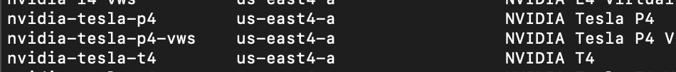

# Shakudo Deployment and Security Documentation - Dec 4, 2023 Update

## **Deployment**

### Service account permissions for Shakudo

Typically the GCP permissions needed to stand up the Shakudo platform from scratch, in a new project are the following:

```jsx
roles/container.clusterAdmin
roles/compute.networkAdmin
roles/iam.serviceAccountUser
roles/storage.objectViewer
roles/dns.admin
```

### Required GCP Resources

#### Kubernetes Environment Assumptions

The resource specification below makes the following assumptions about the existing setup:

- GKE cluster is not reachable from the outside (using an internal VPC)
- Dashboard login portal exposed via internal URL only accessible via VPN
    - As an alternative we can consider using **GCP Identity Aware Proxy**, if currently approved by your enterprise architecture

#### Load Balancer

Ability to create a K8s service with `type: LoadBalancer` that triggers the creation of a GCP load balancer (within the VPC) and an External IP assignment for the K8s service.

#### DNS for a URL to access your platform

Two settings will be required to successfully access the platform through the browser:

- A new `A` type record in the DNS settings for the domain (internal or external e.g., `shakudo.yourdomain.com`) on which the platform will be exposed. Optionally, we can use the `[hyperplane.dev](http://hyperplane.dev)` domain owned by Shakudo, e.g.: `yourdomain.hyperplane.dev`
- A valid SSL certificate with its private key for the above domain. Alternatively, we can use letsencrypt to generate the certificates. This would require the following additional permissions to be available to the GKE cluster during deployment:
    - A GCP service account with permissions to add records to the internal domain or subdomain DNS.
    - (optional) A GCP Workload Identity tied to the `cert-manager` service account in the `hyperplane-certmanager` namespace. The workload identity would be tied to the GCP service account above.

#### Network Traffic

*This can be automated through Shakudo standard deployment scripts*

(Optionally) Create firewall rules to allow Shakudo team access to the cluster (if support package is purchased) by whitelisting our office IP addresses. E.g.:

```bash
gcloud container clusters update $CLUSTERNAME --zone $ZONE \
  --project $PROJECT --master-authorized-networks=$SHAKUDOIP/32 \
  --enable-master-authorized-networks
```

#### Generic platform requirements

GKE cluster (this already exists)

#### Namespaces

Create the following namespaces where {prefix} can be any prefix as required by the SRE team.

Core platform:

- {prefix}-hyperplane-default
- {prefix}-hyperplane-core
- {prefix}-hyperplane-postgres
- {prefix}-hyperplane-pgbouncer
- {prefix}-hyperplane-redis
- {prefix}-hyperplane-istio
- {prefix}-hyperplane-certmanager
- {prefix}-hyperplane-monitoring
- {prefix}-hyperplane-keycloak
- {prefix}-hyperplane-pipelines
- {prefix}-hyperplane-jhub
- {prefix}-hyperplane-conda
- {prefix}-hyperplane-git

Stack Components:

- {prefix}-hyperplane-doris
- {prefix}-hyperplane-flink
- {prefix}-hyperplane-dbt
- {prefix}-hyperplane-trino
- {prefix}-hyperplane-llm

#### Istio and the istio-system namespace

Shakudo uses Istio to manage access to services running within the environment. If an existing deployment of Istio is already installed, the platform can be configured to leverage it. Otherwise, a new namespace called `istio-system` needs to be created and Istio can be deployed as part of the standard platform deployment process.

If Istio is not an option for access control and network traffic management, please let the Shakudo team know which ingress controller you use and we will define the appropriate configuration.

### Node Pools

*Please see `gcloud` CLI commands below to create each node pool*

Estimated total CPU and RAM across all node pools for full use cases: 352 vCPU. 1.1TB RAM

#### Core platform node pools

A single node pool n2-standard-16 

```bash
gcloud container node-pools create hyperplane-pool --project=${GCP_PROJECT} \
        --cluster "${CLUSTER_NAME}" \
        --zone="${COMPUTE_ZONE}" \
        --machine-type=n2-standard-16 \
        --node-labels="hyperplane.dev/nodeType=hyperplane-pool" \
        --num-nodes=7
```

This configuration is assuming no autoscaling. It is possible to use a smaller node pool for the core platform and basic use cases without too many stack components. For example, `num-nodes=4` 

#### LLM use case specific requirements

To begin with a minimal deployment involving only the core Shakudo platform with an LLM service, we can reduce the node pool to a size of 4 nodes:

```jsx
gcloud container node-pools create hyperplane-pool --project=${GCP_PROJECT} \
        --cluster "${CLUSTER_NAME}" \
        --zone="${COMPUTE_ZONE}" \
        --machine-type=n2-standard-16 \
        --node-labels="hyperplane.dev/nodeType=hyperplane-pool" \
        --num-nodes=4
```

Given the difficulty in reserving GPUs required for LLM use cases, as well as the hard regional constraints, we strongly recommend reserving GPU capacity in the region of choice before determining in which region the GKE cluster will be created.

Within the northamerica region, only the `northamerica-northeast1-c` region has the T4 GPUs that we can use for LLMs. 

To get the highest performance, A100 GPUs will be required. The full list of GPU availability per region is available [here](https://cloud.google.com/compute/docs/gpus/gpu-regions-zones). 

For usage of LLMs with GPUs, and in particular, llama models, we recommend the following:

| Model type | GPU |
| --- | --- |
| Llama2-13b | 4xT4, 1xA100-40g, 2xL4 |
| Llama2-13b (bits-n-bytes quantized) | 2xT4, 1xL4 |
| Llama2-70b | 4x A100-40g |
| Llama2- 70b (quantized) | 2xA100-40g |
| Llama2- 70b (quantized - GPTQ) | 2xL4, 4xT4 |
| Llama2-finetuned-13b(https://huggingface.co/WizardLM/WizardLM-13B-V1.2) | 4xT4, 1xA100-40g, 2xL4 |
| Llama2-finetuned-70b (https://huggingface.co/WizardLM/WizardLM-70B-V1.0) | 4x A100-40g |

Below is an example command to create a node pool of two nodes, each with 4 T4 GPUs

```python
gcloud container node-pools create autoscale-t4-pool --cluster $CLUSTERNAME \
--zone=$ZONE --machine-type=n1-highmem-32 --node-version=$NODEVERSION \
--node-labels="hyperplane.dev/nodeType=t4-4-pool" \
--enable-autoscaling --accelerator="count=4,type=nvidia-tesla-t4" \
--disk-size=$DISK_SIZE --disk-type=pd-balanced \
--node-taints purpose=gpu-t4:NoSchedule \
--num-nodes=2 --project $PROJECT
```

A GCP compute disk with 50GB for GPUs:

```bash
gcloud compute disks create shakudo-conda-disk --size=50GB \
--project "${GCP_PROJECT}" --zone "${COMPUTE_ZONE}"
```

A GCP compute disk with 350GB for LLMs: 

```
DISK_NAME=llama-70b-pd
SIZE=350GB
gcloud compute disks create $DISK_NAME --type=pd-balanced \
--size=$SIZE --zone=$ZONE
```

### Deployment Steps - New GKE Cluster and Project

Note that this is for a standard Shakudo deployment. For specific deployment instructions adapted to your environment, please refer to the section above.

1. Create a GCP project using:
`gcloud projects create PROJECT_NAME`
2. Switch to the project you created:
`gcloud config set project PROJECT_NAME`
3. Create Google IAM service account for the project:
    
    ```bash
    gcloud iam service-accounts create SERVICE_ACCOUNT \
    --display-name=DISPLAY_NAME
    ```
    
4. Add permissions for your new Kubernetes cluster:
    
    ```jsx
    gcloud projects add-iam-policy-binding PROJECT_NAME \
    --member='serviceAccount:SERVICE_ACCOUNT@PROJECT_NAME.iam.gserviceaccount.com' \
    --role='roles/container.clusterAdmin'
    
    gcloud projects add-iam-policy-binding PROJECT_NAME \
    --member='serviceAccount:SERVICE_ACCOUNT@PROJECT_NAME.iam.gserviceaccount.com' \
    --role='roles/container.admin'
    
    gcloud projects add-iam-policy-binding PROJECT_NAME \
    --member='serviceAccount:SERVICE_ACCOUNT@PROJECT_NAME.iam.gserviceaccount.com' \
    --role='roles/iam.serviceAccountUser'
    
    gcloud projects add-iam-policy-binding PROJECT_NAME \
    --member='serviceAccount:SERVICE_ACCOUNT@PROJECT_NAME.iam.gserviceaccount.com' \
    --role='roles/storage.admin'
    ```
    
5. Create a service account key file:
`gcloud iam service-accounts keys create ~/path/to/key.json [-iam-account=](mailto:--iam-account=noze-ca-main-sa@noze-ca.iam.gserviceaccount.com)SERVICE_ACCOUNT@PROJECT_NAME.iam.gserviceaccount.com`
6. Activate the service account from above:
`gcloud auth activate-service-account SERVICE_ACCOUNT@PROJECT_NAME.iam.gserviceaccount.com --key-file=~/path/to/key.json`
7. Enable Kubernetes API on the Project if it is not already enabled—to do this you will have to enable billing on the project. 
8. Install kubectl as part of cloud CLI components:
    
    `gcloud components install kubectl`
    
9. [Note: from this step onward, Shakudo has an automated script to run an installation. The details for each step are included for visibility.] Create a GKE cluster in your project:
    1. You should be using GKE version 1.25.x, 1.26.x, or 1.27.x to ensure all our helm chart resources can be installed and managed via helm.
    2. The cluster location is important in terms of GPU node pools for specific use cases—make sure your machine type is available in your zone before creating a cluster.
        - Use `gcloud compute accelerator-types list` to check if it has the types you want
    
    ```bash
    export CLUSTER_NAME=cluster-name
    export COMPUTE_ZONE=compute-zone
    export PROJECT=project-name
    ```
    
    ```bash
    gcloud container clusters create $CLUSTER_NAME \
    --num-nodes=2 \
    --cluster-version=1.25.11-gke.1000 \
    --zone=$COMPUTE_ZONE \
    --machine-type=e2-standard-2 \
    --node-labels="hyperplane.dev/nodeType=hyperplane-system-pool" \
    --enable-autoscaling \
    --min-nodes=2 \
    --max-nodes=$MAX_NODES
    ```
    
10. Create the default node-pools for Shakudo:
    
    ```bash
    gcloud container node-pools create hyperplane-pool \
    --cluster $CLUSTER_NAME --zone=$COMPUTE_ZONE \
    --machine-type=n4-standard-16 --node-version=1.25.11-gke.1000 \
    --node-labels="hyperplane.dev/nodeType=hyperplane-pool" \
    --enable-autoscaling --min-nodes=0 --max-nodes=7
    ```
    
11. Get the kubeconfig for your cluster:
    
    ```bash
    gcloud container clusters get-credentials $CLUSTER_NAME \
    --zone $COMPUTE_ZONE --project $PROJECT_NAME
    ```
    
12. Create a bucket to store metadata from Shakudo Jobs, ensuring the bucket name matches the helm values file value in the steps below
    
    `gsutil mb gs://$BUCKET_NAME`
    
13. Inside the `monorepo` repository in `charts/shakudo-platform` generate RSA keys for your main git repo using:
    1. `ssh-keygen -t rsa -N '' -f keys/id_rsa_github`
    2. `ssh-keygen -o -a 100 -t ed25519 -N '' -f charts/sshportal/keys/id_ed25519_ssh`
14. Replace the related values in the values file: 
    
    ```bash
    cd helm/chart/path/shakudo-platform/
    cp valuesTemplate.yaml values_deployment.yaml
    sed -i '' -E "s#TOREPLACEDEPLOYMENTNAME#$DEPLOYMENT_NAME#g" values_deployment.yaml
    sed -i '' -E "s#TOREPLACEGCPBUCKETNAME#$BUCKET_NAME#g" values_deployment.yaml
    sed -i '' -E "s#TOREPLACEGITHUBRSAPUBKEY#$(cat keys/id_rsa_github.pub | tr -d '\n')#g" values_deployment.yaml
    sed -i '' -E "s#TOREPLACEOAUTHCLIENTSECRET#$(openssl rand -hex 20)#g" values_deployment.yaml
    sed -i '' -E "s#TOREPLACECLOUDPROVIDER#GCP#g" values_deployment.yaml
    ```
    
    ```bash
    sed -i '' -E "s#: oci-bv#: standard#g" values_deployment.yaml
    sed -i '' -E "s#: oci#: standard#g" values_deployment.yaml
    sed -i '' -E "s#: \"OCI\"#: \"GCP\"#g" values_deployment.yaml
    ```
    

14. Add optional configurations:

- Optional: Open the values file and make any other desired customizations, such as including the path to your GCP credentials/config JSON in `gcp.enabled.clientServiceAccountJSON`
1. Shakudo maintains a live sync of your git repository and branch, and it considers users’ code *deployed* once the code is pushed to the linked branch and synced with the Shakudo platform. Users can then trigger Shakudo PipelineJobs to run their code either immediately or on a schedule. To allow this feature, add your generated key `helm/chart/path/shakudo-platform/keys/id_rsa_github.pub` to your repository as a deploy key.
2. Apply the CRD’s, Prometheus and other helm resources:
    
    ```bash
    kubectl apply -f static/crds/
    kubectl apply -f static/prometheus-0/
    kubectl apply -f static/prometheus-1/
    kubectl apply -f static/prometheus-2/
    kubectl apply -f static/cert-manager/
    ```
    
3. Make sure the correct istio VPC network rules are applied
    1. You can use the GCP dashboard or use the command line to create a VPC Network Rule (Not a Network firewall policy)
    
    ```bash
    gcloud compute --project=YOUR_PROJECT firewall-rules create istio \
     --direction=INGRESS --priority=1000 --network=default --action=ALLOW \
     --rules=tcp:10250,tcp:443,tcp:15017 --source-ranges=0.0.0.0/0
    ```
    
4. Install the `shakudo-platform` helm chart
    
    ```bash
    helm install shakudo-hyperplane . \
     --values values_deployment.yaml
    ```
    
5. Configure the DNS setup to point from your LoadBalancer IP address (in `services` ) to your domain.
    1. One `A` record from `domain.root.dns` to the LoadBalancer IP
    2. One `A` record from `*.domain.root.dns` to the LoadBalancer IP
6. Check your URL too see your cluster is up (Can take `ttl` seconds to propagate) 
7. Set up Keycloak and SSO with Google IDP using the guide below. Note that Shakudo has a script and keycloak client config. These steps are written out for visibility. 
    
    [Shakudo Keycloak Configuration Guide](other/shakudo-keycloak-guide?id=keycloak-configuration)
    

#### Notes and issues you may face if your URL does not display the dashboard

1. Your `certs` may not be issued
    1. Check the Kubernetes `certs` resources, and ensure that the status is “Certificate is up to date and has not expired”. Some common issues with certs not being provisioned are the service account provided to the LetsEncrypt cluster issue may not have sufficient DNS permissions, or http might be blocked by firewall. 
    2. Your DNS records may not have propagated or your URL might be resolving to the incorrect load balancer IP address. Check if your Shakudo dashboard URL is resolving to the correct IP address with `nslookup` (`nslookup domain.root.dns`), ensuring the displayed IP matches the IP of your “istio-ingressgateway” loadbalancer service’s External-IP.
2. Check if all pods are running and healthy, and there are no isitio sidecar issues. If either the keycloak or oauth2-proxy pods are unhealthy, and the oauth2-proxy pog logs are showing errors reaching the dashboard login, the issue is likely related to istio.  Ensure there are no firewall policies or VPC firewalls blocking in-cluster requests on ports 10250, 15017 and 443
3. Ensure the jobs for PodSpecs and Default PlatformApps have completed successfully - the API version is important as older versions may not contain the resource files
4. Check if the node-pools and nodes are created successfully, and all Shakudo main pods are in a healthy state. These critical pods include the hyperplane-dashboard, api-server, reconciler, postgresql-0, redis-0. 

### Adding GPU Node Pools to GKE Cluster

When adding a GPU node pools there are a few things to consider:

1. Ensure that your desired GPU machine is available in your cluster - this should be done during cluster creation. To view the list of all GPU’s available per zone you can run:
    
    ```bash
    gcloud compute accelerator-types list
    ```
    
2. In our example we are going to install an `nvidia-tesla-t4` gpu in `us-east4-a` zone, we can verify the availability from the results above. 
    
    
    
3. Next step is to check the quota in our zone for that GPU type
    
    Visit [https://console.cloud.google.com/iam-admin/quotas](https://console.cloud.google.com/iam-admin/quotas) to check the GPU quota availability in your zone. For our example above, we can see the following:
    
    
    
    This shows that we have quotas for 8 GPUs of type T4 in the us-east4 region. Below is Google Cloud’s recommendation:
    
    > Your GPU quota should be at least equivalent to the total number of GPUs you intend to run in your cluster. If you enable [cluster autoscaling](https://cloud.google.com/kubernetes-engine/docs/concepts/cluster-autoscaler), you should request GPU quota at least equivalent to your cluster's maximum number of nodes multiplied by the number of GPUs per node.
    
    For example, if you create a cluster with three nodes that runs two GPUs per node, your project requires at least six GPU quota.
    > 
    
4. Create your node pool using the following command:

```
gcloud container node-pools create autoscale-gpu-pool \
 --cluster $CLUSTER_NAME \
 --region $COMPUTE_ZONE \
 --node-locations $COMPUTE_ZONE \
 --machine-type=n1-standard-8 \
 --accelerator type=nvidia-tesla-t4,count=1 \
 --node-version=1.25.11-gke.1000 \
 --node-labels="hub.jupyter.org/node-purpose=user,hyperplane.dev/nodeType=gpu-pool" \
 --node-taints=purpose=gpu-t4:NoSchedule \
 --enable-autoscaling \
 --num-nodes=1 \
 --min-nodes=0 \
 --max-nodes=2
```

- Note that not every GPU accelerator type is compatible with every Google Compute machine type.  Make sure your machine type supports your chosen GPU type: [https://cloud.google.com/compute/docs/gpus](https://cloud.google.com/compute/docs/gpus)
- Make sure you specify the node-locations - this is recommended by the GCP docs
    
    > **`COMPUTE_ZONE1**,**COMPUTE_ZONE2**,[...]`: the specific [zones](https://cloud.google.com/compute/docs/regions-zones#available) where GKE creates the GPU nodes. The zones must be in the same region as the cluster, specified by the `--region` flag. The GPU types that you define must be [available](https://cloud.google.com/kubernetes-engine/docs/how-to/gpus#availability) in each selected zone. We recommend that you always use the `--node-locations` flag when creating the node pool to specify the zone or zones containing the requested GPUs
    > 
1. Create a Persistent disk for your `conda` components using:
    
    ```bash
    gcloud compute disks create DISK_NAME --zone=$COMPUTE_ZONE \
    --size 50 \
    --type pd-ssd
    ```
    

### Process for Shakudo Software Updates

Shakudo software updates are delivered through a set of new container images and a helm upgrade. To ensure proper governance and approvals, the following process is recommended:

1. Shakudo periodically releases a new set of images that represent the latest platform and component versions. The frequency of releases is approximately once a month.
2. For every new release, Shakudo will confirm with the client whether this release should be deployed to the customer’s environment. 
3. If the client decides to deploy the new release, Shakudo provides the client the following artifacts:
    1. Updated image URLs to be cloned into the client’s GCR repositories
    2. Updated configuration files for the Shakudo platform
    3. Update scripts for the Shakudo platform (if any)
4. Shakudo support team, in collaboration with the client SRE team, execute the update during a maintenance time window. Typically, no downtime is expected. If downtime is expected, the Shakudo support team will inform the client SRE team and coordinate an appropriate time to minimize business impact.

#### GCR image scanning

New Stack Components integrated by Shakudo, as well updates to existing Stack Components and Shakudo Core components, are delivered through container images

Images for all components of the Shakudo platform are hosted on our private repository on Google Container Registry, with vulnerability scanning for known security vulnerabilities and exposures. Images are automatically scanned images whenever they are pushed to the registry via Google’s Container Scanning API. All our images are Alpine, Debian, or Ubuntu based, which are all covered by Google Cloud’s Container Scanning API. 

#### Security Incidents Requiring Updates

Shakudo runs periodic scans over container images and live clusters hosted within the Shakudo infrastructure, and monitors news feeds related to zero day vulnerabilities in components and libraries used by the Shakudo platform. When vulnerabilities are identified, Shakudo sends a notification to all clients with a timeline for a hotfix that addresses the vulnerability and any immediate action that needs to be taken to protect the client’s systems from possible attacks.

Once a hotfix update is available, the standard update process described in this section (**Process for Shakudo Software Updates**) is executed with condensed timelines to address the vulnerability in a timely manner.

### Process for Kubernetes Version Updates

The Shakudo Platform has two types of K8s resource: 1) the Shakudo core components, which are delivered through the *shakudo-platform* Helm chart, and 2) K8s resources for scale-up workloads and Shakudo objects, which the Shakudo *api-server* and *reconciler* components create and manage. Therefore, to ensure the most seamless Shakudo environment update, it is best to check with the Shakudo team before performing a major version upgrade to your Kubernetes cluster.  

Typically we require updates to the Shakudo platform app and chart version before the Kubernetes cluster is updated. 

## **Security**

### Shakudo Platform Access Control

#### Platform Access Control via SSO

The Shakudo platform uses Keycloak to simplify single sign-on with identity and access management. Currently supported identity providers are Google, Okta, and Azure AD. SSO can and should) be limited to your organization’s hosted domain. You can choose to additionally gate access such that the keycloak admin must approve each user before they are able to access the Shakudo dashboard. Please see our attached instructions for setting up Google as an Identity Provider (IDP) for Keycloak SSO. 

[Shakudo Keycloak Configuration Guide](other/shakudo-keycloak-guide?id=keycloak-configuration)

#### API Endpoints Access Control via JWT

The only components exposed from within the Kubernetes cluster are the Istio Gateway and the Keycloak authentication endpoint. However, users can access private API endpoints within Shakudo using JWT tokens. 

When a user logs in, Keycloak issues JSON Web Tokens (JWTs) that contain user claims, such as roles and permissions. To access any Shakudo service protected behind Keycloak, for example an LLM service, users may generate a JWT token and use the token within the authorization header of their request. 

Below is example code to generate a JWT token, and then pass the token as a header to hit a protected Shakudo API endpoint

```jsx
token=$(curl --location --request POST 'https://yourdomain/auth/realms/Hyperplane/protocol/openid-connect/token' --header 'Content-Type: application/x-www-form-urlencoded' --data-urlencode 'grant_type=password' --data-urlencode 'username=jwt-user' --data-urlencode 'password=kwMGCHJdzqchog7K89H_' --data-urlencode 'client_id=istio' -k | jq -r ".access_token")
curl --location 'https://yourdomain/llama2-13b/generate' \
--header 'Content-Type: application/json' \
--header 'Authorization: Bearer $token' \
--data '{"inputs":"What is Deep Learning?","parameters":{"max_new_tokens":200}}'
```

### Workload Identity and GCP Service Account Mapping

You may choose to extend the permissions of Kubernetes Service Accounts that are managed by Shakudo through the use of Workload Identity in GCP. 

Workload Identity is a feature in Google Kubernetes Engine (GKE) that is primarily used for enhancing security and managing identity and access control within your Kubernetes clusters. It allows you to map a Kubernetes Service Account (KSA) to a Google Cloud Service Account (GSA). This mapping establishes a trust relationship, enabling pods within your cluster to use the GSA's identity for authenticating and authorizing access to Google Cloud resources. It helps ensure that pods running within your cluster have the appropriate permissions when interacting with Google Cloud resources, such as Cloud Storage, BigQuery, Pub/Sub, etc. Each pod can be associated with a specific GSA, and access control is managed at the GSA level, eliminating the need to store and manage Google Cloud service account keys or credentials in your Kubernetes cluster's configuration or environment variables. 

All workloads on Shakudo (User Sessions, User Services, Pipeline Jobs, etc.) are compatible with Workload Identity. Permissions for issuance of certificates for the cluster domain can also be done through Workload Identity. 

### Shakudo Support Team Access Options

When the Shakudo platform is deployed in your GCP tenancy, Shakudo offers a few options for our support team to access your cluster for ongoing updates, maintenance, and support. 

Option 1

You can give Shakudo limited access to a GKE cluster, with permissions only sufficient to provide support within its designated Kubernetes namespaces within that K8s cluster. This can be delivered through a kubeconfig with a token for a K8s service account. The Shakudo team can also be onboarded with your company’s emails and use those credentials to generate a kubeconfig to access the the cluster. 

Option 2 - LD preferred

You can restrict access to your company’s employees exclusively, in which case the Shakudo team can provide support via Slack and screen sharing for both deployment and ongoing maintenance and support. 

### Shakudo Platform Monitors

Shakudo tracks the following security related events:

1. Keycloak events (including all login attempts)
2. User actions on the platform

#### Keycloak Events

**Keycloak events** describe all events from user logins and attempts to log in to the platform. By default, Shakudo currently stores the following information for logins:

- Date and timestamp
- Event type (Login error, login, identity provider first login, etc.)
- Source ip
- Error type (if applicable)
- Identity provider
- Username
- Redirect uri

Below is an sample keycloak event

timestamp:                  [2023-02-06 21:15:51.114000]

event_type:                 [LOGIN_ERROR] in Hyperplane

ip:                         10.0.15.1

error_type:                 user_not_found

udentity_provider:          None

identity_provider_identity: None

username:                   stella@shakudo.io

redirect_uri:               https://yourdomain/oauth2/callback

#### User Actions on Shakudo

**User actions** describe all user actions on the Shakudo platform after login and authentication, including the following:

- Action type
- Job id
- Timestamp
- Start time (if applicable)
- Completion time (if applicable)
- Status (Pending, Running, Timeout, Done, Fail)
- Status Reason (if applicable)
- User id
- User email
- Job details (path to script, image used, typically not related to security)

Below is an example user action

action:                     createScheduledJob

jobId:                      a773290c-2ad7-474c-afb1-df0ca2b29c93

timestamp:                  2023-02-06 21:15:51.114000

Start_time:                 2023-02-06 21:16:51.114000

completion_time:            2023-02-06 23:19:51.114000

status:                     In progress

status_reason:              None

user_id:                    None

user_email:                 stella@shakudo.io

Job_details:                None

The mechanism to retrieve and push recent logins is the following: a scheduled private job that runs on the Shakudo platform retrieves Keycloak events and user actions at a pre-configured interval and pushed the data to an API endpoint (e.g. Splunk). The data can be formatted as a JSON array or a CSV string.

## **Limitations and Upcoming Enhancements**

Documented below are known limitations in our current release that we have identified based on customer feedback and industry trends. Below are the details of identified limitations and the features that will be introduced in the upcoming releases.

#### **1. Launching Workloads from Cloud Kubernetes to On-premises GPU machines**

**Feature Request:** Users have expressed the need to seamlessly launch workloads from cloud Kubernetes environments to on-premises GPU clusters.

**Solution:** In response to this feedback, we are developing a feature that will enable users to launch workloads from cloud-based Kubernetes (Shakudo) environments directly to on-premises GPU host machines.

**Release Schedule:** This feature is on track for release in Q1 of the upcoming year.

#### **2. Traffic Shaping and Canary Rollouts**

**Feature Request:** Users have requested enhanced control over traffic shaping and the ability to perform canary rollouts for user-created services.

**Solution:** Our development team is actively working on implementing traffic shaping capabilities, including canary rollouts. This will provide users with more granular control over user-created service deployments and updates.

**Release Schedule:** The release of this feature is planned for the next major update, scheduled for end of December 2023.

#### 3. **In-Cluster Pull-Through Cache for Workload Setup Acceleration**

**Feature Enhancement:** To optimize the performance of pod creation, we are developing an in-cluster pull-through cache for images.

**Background:** Currently, image pull during pod creation can result in longer startup times, particularly in workloads that require larger images. 

**Solution:** The upcoming in-cluster pull-through cache will offer an optional mechanism to cache frequently used images within the cluster, significantly reducing the time required for pod initialization.

**Release Schedule:** This feature is scheduled for release in Q4 of the current year.

## **Support During Deployment**

While we aspire to provide the best and most comprehensive documentation for deploying Shakudo on GCP, every environment is different and unexpected issues may arise during deployment. Rest assured that the Shakudo team is here to support you through the deployment and beyond. During deployment, you can use the following methods to contact the team and get support on any deployment related issues:

**Slack:** if a joint Slack channel has been established prior to starting deployment, the Shakudo support team will be available through the channel during business hours

**PagerDuty:** outside business hours, you can trigger a pager notification to our on-call customer success representative and on-call engineer by filling out [this](https://share.hsforms.com/1tuULD5lLQoyed2tP2DS4OQcpzhy) short form. **Make sure to select P0 as the urgency to trigger a pager.** Our on-call will then follow up within 30 minutes (usually less, but the SLA is 30 minutes) via Slack or email.

**Email:** you can send an email to *support@shakudo.io* and it will be received by multiple members of the support team. You can expect a quick response during business hours.

**Phone:** you can call corporate phone number *(437)783-5683* and expect a call back or follow up by email/slack within 24 hours.