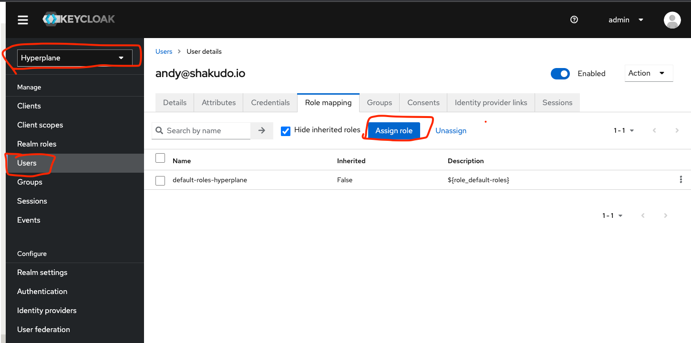
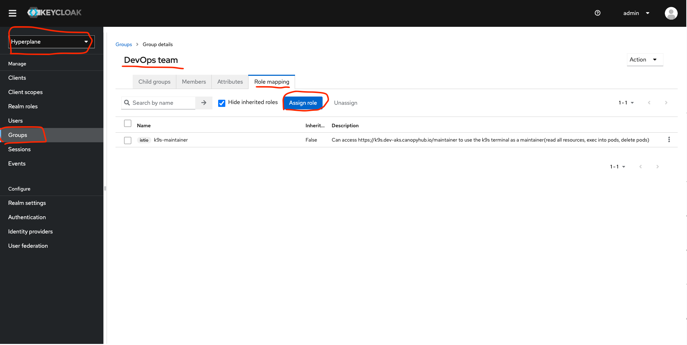
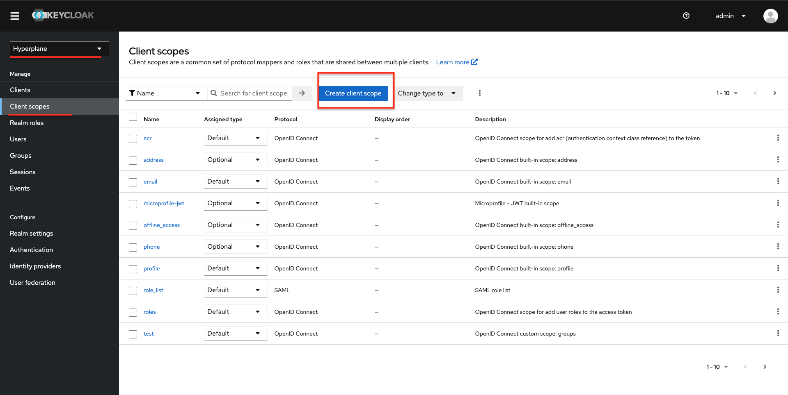
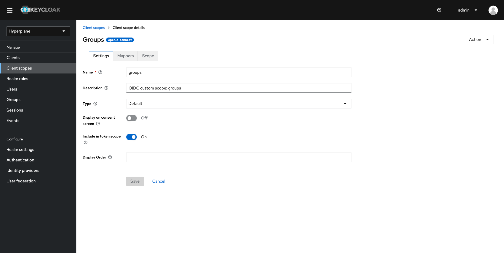
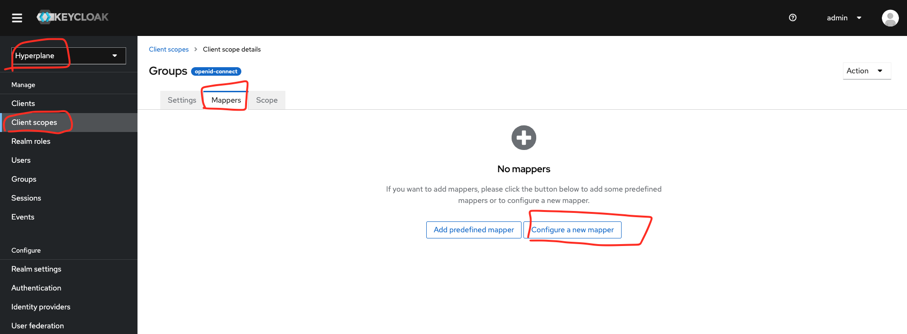
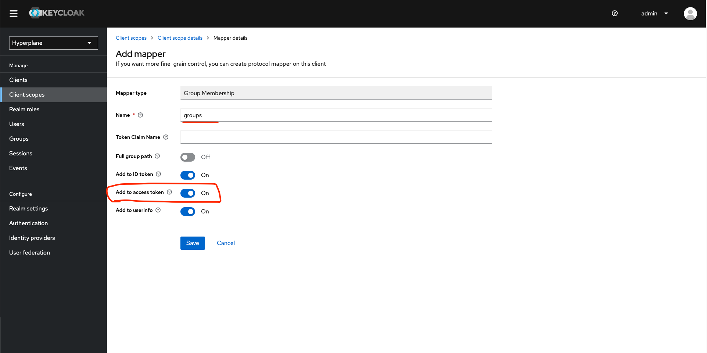
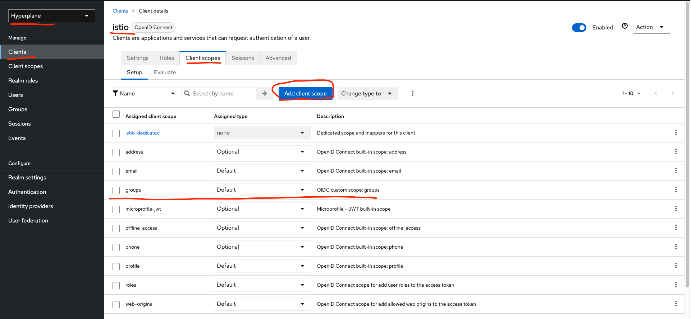
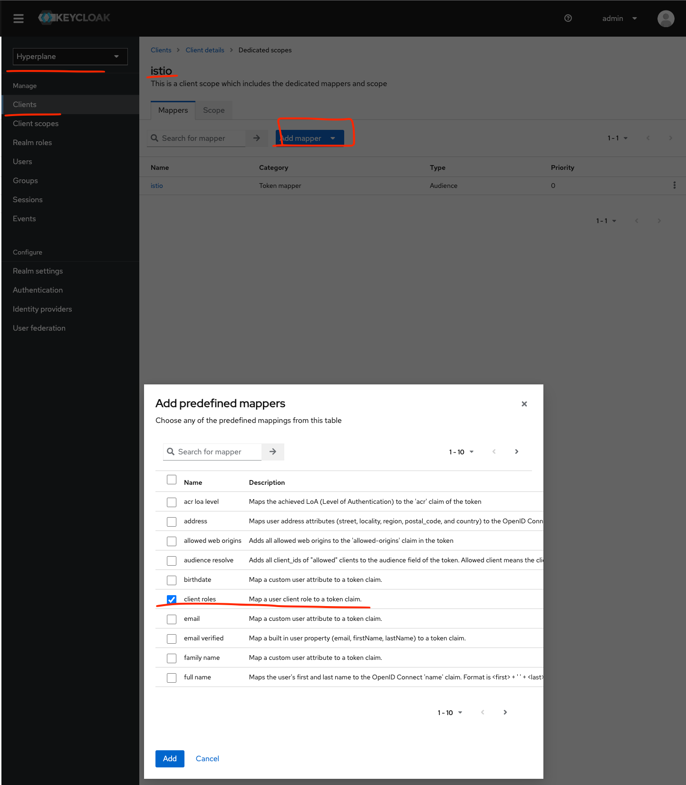

# Shakudo Keycloak Configuration Guide

## Keycloak configuration

To configure your keycloak, first visit your keycloak manager (e.g. https://yourname.hyperplane.dev/auth/)

[https://lh6.googleusercontent.com/I-0jzJnphDGkwBm87QG--geR1vou5AB3FXapVDebCCBEh5Q_uTVYwAaVGTvKIKGvoYXMri94W861NtoneJTMDQ1zNK44nAUvQIMAbxQsW-mYUxEifP0jdhUpehgc3DWQOo8ntYyJ_Sipuv9Zm4oIK40](https://lh6.googleusercontent.com/I-0jzJnphDGkwBm87QG--geR1vou5AB3FXapVDebCCBEh5Q_uTVYwAaVGTvKIKGvoYXMri94W861NtoneJTMDQ1zNK44nAUvQIMAbxQsW-mYUxEifP0jdhUpehgc3DWQOo8ntYyJ_Sipuv9Zm4oIK40)

Click on “Administration Console”

You will need to log in with username “admin”, and fill in the password with the contents of the “keycloak-login-pass” k8s secret . Press “x” on the secret to get the decoded password.

[https://lh6.googleusercontent.com/3GSXdU9Im-sZcxbLz628wXZ67nj2QBmh1GJZkaQ8PaPCTim4kvQbEe6cOMa5Zp-iAObyDu28d89Q-a1uKspC2gsXapSsJSsJkdoAdO-SUNb3cwSeafQoskEZknYBi124aCskpa6h92C8b_r5zums9-Y](https://lh6.googleusercontent.com/3GSXdU9Im-sZcxbLz628wXZ67nj2QBmh1GJZkaQ8PaPCTim4kvQbEe6cOMa5Zp-iAObyDu28d89Q-a1uKspC2gsXapSsJSsJkdoAdO-SUNb3cwSeafQoskEZknYBi124aCskpa6h92C8b_r5zums9-Y)

**Realm**

Once you are logged into keycloak, you will need to click the top left arrow to add a new realm. Fill in the *Name* field with “Hyperplane”.

[https://lh6.googleusercontent.com/e_zsRbfYuKerGtu_uIho7DmIwCNuBz4lB3qK7LLXcQWYLpshnptz-b0cYMjPe6Rgb7Pd_IVgkrRMoG0PezR2D1HdGj7AaGQR_gLqOrJ6VMPDEavGxPt7_xkyk69i7LU0XLWGAYtq6z_iTyKhq7sxRzc](https://lh6.googleusercontent.com/e_zsRbfYuKerGtu_uIho7DmIwCNuBz4lB3qK7LLXcQWYLpshnptz-b0cYMjPe6Rgb7Pd_IVgkrRMoG0PezR2D1HdGj7AaGQR_gLqOrJ6VMPDEavGxPt7_xkyk69i7LU0XLWGAYtq6z_iTyKhq7sxRzc)

**Client**

Next, you will need to configure a Client. Click into the *Clients* tab on keycloak and click *Create*. Fill in the Client ID field with “istio” and leave the rest as is.

[https://lh3.googleusercontent.com/wfGz66k3QcZdqPbWCWbZM_gyWx4rREXov4dy3Ja_iLsqBSnPGvOjJQzt6g9JaKAsaZh4rZlLp67xJCzE75iPQK10HsUNZLmd2kCojh2iXoPo_mj8ZRURNR3KVVZJyET6y9q0jhOp-Ei_8MKfIFszkrE](https://lh3.googleusercontent.com/wfGz66k3QcZdqPbWCWbZM_gyWx4rREXov4dy3Ja_iLsqBSnPGvOjJQzt6g9JaKAsaZh4rZlLp67xJCzE75iPQK10HsUNZLmd2kCojh2iXoPo_mj8ZRURNR3KVVZJyET6y9q0jhOp-Ei_8MKfIFszkrE)

Next, go back to the *Clients* tab. Click on the “istio” Client id link. You will see a form like the below. Please fill in the fields so they match the following:

[https://lh5.googleusercontent.com/EPdbfNhRpqUJ0rtbktXAn3kd8_mqc05V1xjdBG6HlqIH9Tc8_zgN9zz5geNIXWqZ9JLQK4nwzRmsaPQe-Qjnf1GxIC2VlGP1GuRKPXYg6mAsCMVFOVgOuy_9-9FKgKbh6ltssGfifyFeaLCCY3TBUr4](https://lh5.googleusercontent.com/EPdbfNhRpqUJ0rtbktXAn3kd8_mqc05V1xjdBG6HlqIH9Tc8_zgN9zz5geNIXWqZ9JLQK4nwzRmsaPQe-Qjnf1GxIC2VlGP1GuRKPXYg6mAsCMVFOVgOuy_9-9FKgKbh6ltssGfifyFeaLCCY3TBUr4)

In the *Valid Redirect URIs* field, please create a record for each of the following:

- [https://grafana.yourname.hyperplane.dev/](https://grafana.yourname.hyperplane.dev/)
- [https://grafana.yourname.hyperplane.dev/*](https://grafana.yourname.hyperplane.dev/*)
- [https://grafana.yourname.hyperplane.dev](https://grafana.yourname.hyperplane.dev/)
- [https://yourname.hyperplane.dev/](https://yourname.hyperplane.dev/)
- [https://yourname.hyperplane.dev/*](https://yourname.hyperplane.dev/*)
- [https://yourname.hyperplane.dev](https://yourname.hyperplane.dev/)

In the *Web Origins* field, add “*”.

Press *Save*.

Next, you will need to go to the *Mappers* tab within the “istio” client. Click on the *Create* button.

[https://lh5.googleusercontent.com/UsLzM9OYO0g5xuFLhqRMnPLsECYcm6BO7I6MvNUiX-qqBb8mK8wB5tZyOOrzvZFrzk4yf_r-02O8zVLJD7HdUgolthWIZVFE654NpamXE3YWzd5YLLD8X_5WucN548jnRY1eQyQc4BiSZn5lFQS6gc4](https://lh5.googleusercontent.com/UsLzM9OYO0g5xuFLhqRMnPLsECYcm6BO7I6MvNUiX-qqBb8mK8wB5tZyOOrzvZFrzk4yf_r-02O8zVLJD7HdUgolthWIZVFE654NpamXE3YWzd5YLLD8X_5WucN548jnRY1eQyQc4BiSZn5lFQS6gc4)

Fill in the form with contents to match the following, and press *Save*.

[https://lh4.googleusercontent.com/sVU2ra5FzUvyoOmyVW7RKLokv9xQPKtMvhT05GcRu0cV_Ia9KLVCp3WHY5C68SAKo7NqZ5Au5wbs-oZYaqbu6Y5mO0_IahGE5g6U-czBOl9Sb9U_1hbXNrwGumWh52dhW5dV1MFJSe4g4fmyIcYGUTY](https://lh4.googleusercontent.com/sVU2ra5FzUvyoOmyVW7RKLokv9xQPKtMvhT05GcRu0cV_Ia9KLVCp3WHY5C68SAKo7NqZ5Au5wbs-oZYaqbu6Y5mO0_IahGE5g6U-czBOl9Sb9U_1hbXNrwGumWh52dhW5dV1MFJSe4g4fmyIcYGUTY)

Your istio client should now be set up! We will configure SSO next.

**SSO with IDP**

Return to the keycloak home page (e.g. https://yourname.hyperplane.dev/auth/). Go to the *Identity Providers* tab and click the *Add Provider…* dropdown on the right. If you would like to set up SSO with Google, choose “Google” and fill in the form to match the image below:

[https://lh4.googleusercontent.com/xjJaPssnD1GvBniWuMF6DiueeSrS3SpX5vSpqB6YN1aqUg1xALb2Nmc2TClwc9UrSTa8bIrfwtbJgf9YMNKFIOLEGiHC1qNloLgnMYCj6Kv8qu2vf1MS4p6NtqURno2vi-OkfLp32f54mPnIap81r5E](https://lh4.googleusercontent.com/xjJaPssnD1GvBniWuMF6DiueeSrS3SpX5vSpqB6YN1aqUg1xALb2Nmc2TClwc9UrSTa8bIrfwtbJgf9YMNKFIOLEGiHC1qNloLgnMYCj6Kv8qu2vf1MS4p6NtqURno2vi-OkfLp32f54mPnIap81r5E)

For the Client ID and Client Secret fields, you can use an existing Google Client ID for Web application. Alternatively, Shakudo can provide you with a set of credentials to use. 

If you want to allow everyone at a certain domain to log in, enable the “Trust Email” toggle, and add a “Hosted Domain”, which will be your email domain. If you choose not to enable the “Trust Email” option, the keycloak admin will have to manually approve each user via the keycloak console. 

Users should now be able to access the Shakudo dashboard (e.g. [https://yourname.hyperplane.dev](https://yourname.hyperplane.dev/)) and sign in with their Google credentials. 

---

# Role based access controls

The Shakudo platform has a list of protected resources an authenticated user is authorized to access:

  - `dashboard-admin`: By default, users are only authorized to managed their own workloads in the Shakudo dashboard. This role gives access to a user in the Shakudo dashboard to manage any workload or see any admin UI controls. 

By default, any authenticated user can navigate to https://k9s.<domain> to access a k9s terminal with read-only access on any cluster resource EXCEPT secrets.

  -  `k9-maintainer`: Can navigate to https://k9s.<domain>/maintainer to access a k9s terminal with read access on all cluster resources, with the ability to terminate or exec into pods.

  - `k9s-admin`: Can navigate to https://k9s.<domain>/admin to access a k9s terminal with cluster admin access. Be cautious of which users you grant this role to.

To give users these roles, we can directly assign the role to the user.

Alternatively, for easier management of your users and their level of access, the recommended way is to create a group, and assign roles to that group. You can then add users to the group to inherit all the assigned roles for the group. For example,

# Set up mappers

This section ensures that the roles and groups from the previous section is actually used when in the authorization process by ensuring the proper claim is in the JWT access token.

1. Create a client-scope for groups

1. Configure a mapper for the client scope created in the previous step.
    
    
    
    Select the Group Membership mapper, and ensure Add to access token is on.
    
    
    

1. In the *istio* client, add the client scope created from the previous steps.
    
    
    
2. In the *istio-dedicated* client scope, add a mapper for the client roles.
    
    